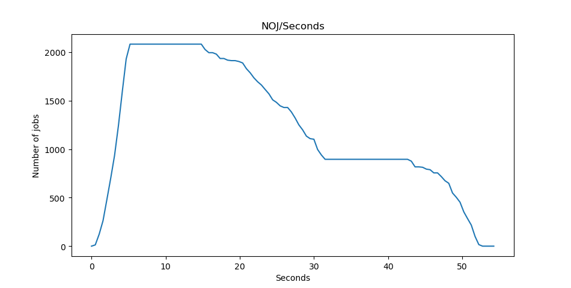
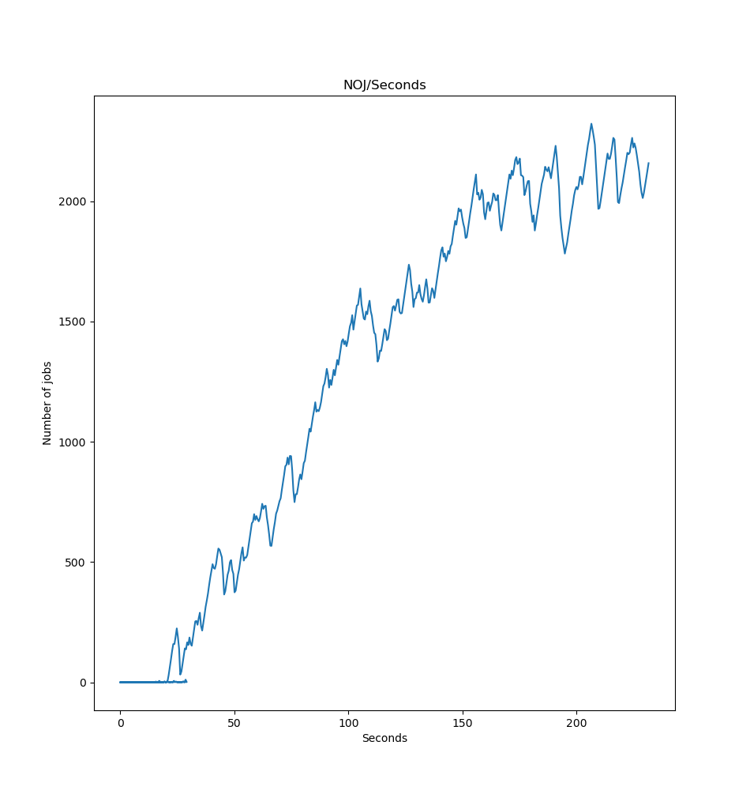

# Давыдов Михаил Б21-505 ПАРВПО Лабораторная работа N3 2024
## Реализуемая система

Автоматизированная система по проведению атаки грубой силой на различные хэши.

1. Сервис предоставляет возможность отправить запрос на проведение атаки грубой силой на указанный хэш.
2. 1. Если значение данного хэша уже есть в базе данных, то пользователю незмедлительно направляется ответ
    2. Если значение данного хэша в базе отсутствует, то сервис выполняет атаку перебором на данных хэш по встроенному словарю.

3. На проведеение одной атаки существует ограничение по времени (устанавливается на усмотрение администратора сервиса).
4. Сервис имеет endpoint для просмотра текущего количества хэшей в очереди.

### Используемые технологии

1. go-fiber 
2. go-redis 
3. redis

### Обоснование необходимости использования брокера сообщений

Поскольку в ситуации когда искомый хэш отсутствует в базе данных или в его генерации использовалась соль выполняется перебор по словарю, может возникнуть ситуация, когда сервис будет временно не в состоянии обработать все входящие запросы, поэтому задачи по выполнению атаки перебором будут поставлены в очередь.

### TODO

1. Добавить интеграцию с [этим](https://github.com/mandiant/gocrack).
2. Добавить возможность использовать собственные словари.
3. Для наглядной демонстрации просадки во времени ответа сервера было решено убрать функционал занесения в базу данных найденных хэшей.

### Заключение

На графике виден момент, когда нагрузка перестает быть столь великой. Участки плато на графе объясняются наличием серди запросов хэшей, для которых не может быть восстановлен пароль, попадание таких хэшей в очередь вызовет необходимость перебора всех пароль из списка или же ожидание тайм-аута. 

На графике нагрузочного тестирования с превышением ресурсов сервера на 20-30% виден уклон вверх, так как количество хэшей, поступающих в обработку, превышает количество обрабатываемых в единицу времен.

В результате данной лабораторной работы был освоен механизм брокера и синхронной очереди, а также написан превосходный код на го.
