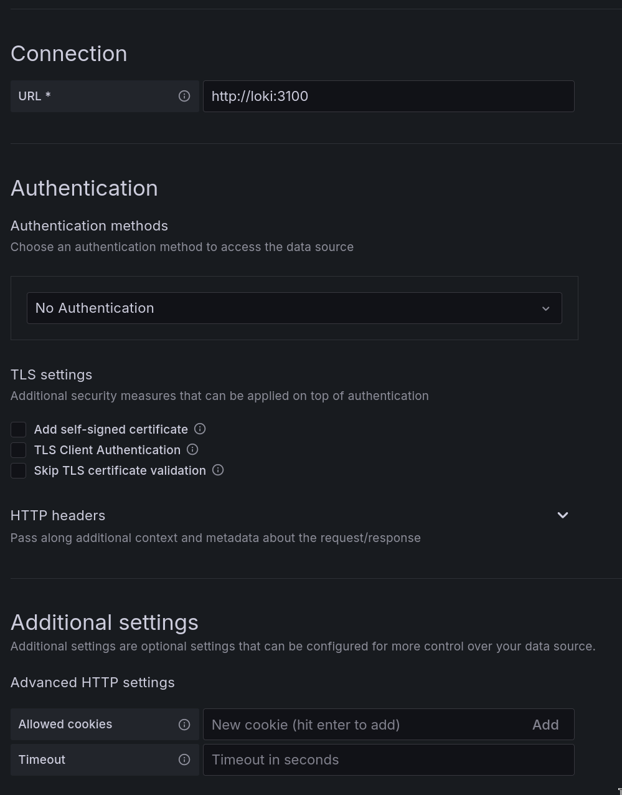
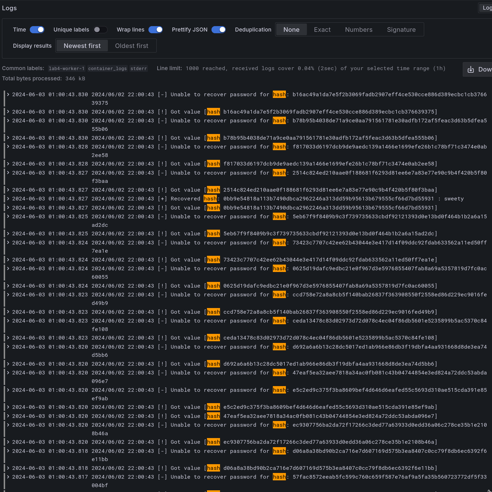
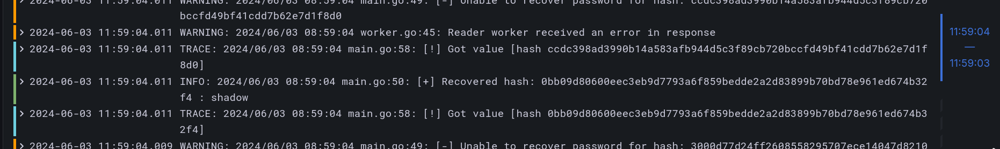
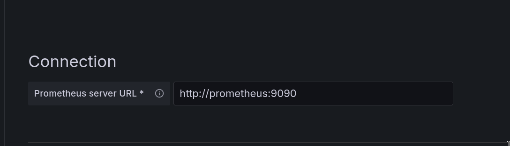
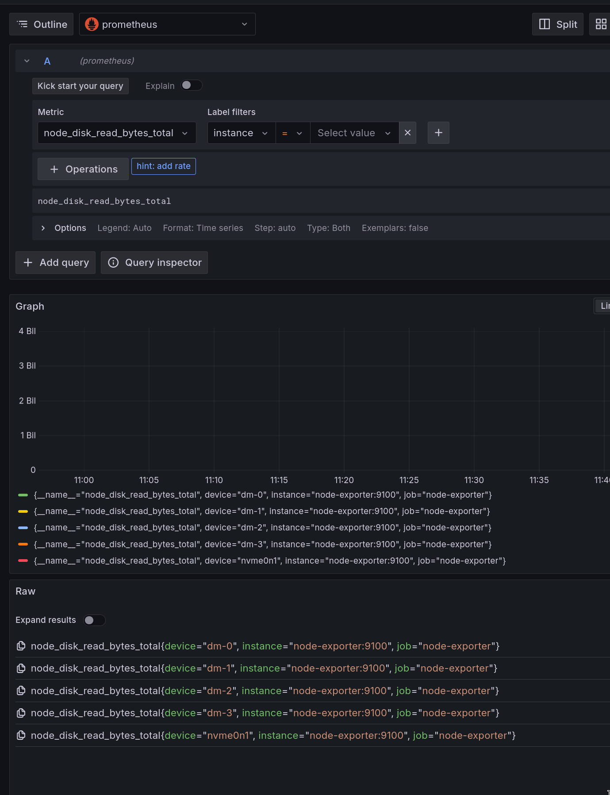

# Давыдов Михаил Б21-505 ПАРВПО Лабораторная работа N3 2024

## Реализуемая система

Автоматизированная система по проведению атаки грубой силой на различные хэши.

1. Сервис предоставляет возможность отправить запрос на проведение атаки грубой силой на указанный хэш.
2. 1. Если значение данного хэша уже есть в базе данных, то пользователю незмедлительно направляется ответ
    2. Если значение данного хэша в базе отсутствует, то сервис выполняет атаку перебором на данных хэш по встроенному словарю.

3. На проведеение одной атаки существует ограничение по времени (устанавливается на усмотрение администратора сервиса).
4. Сервис имеет endpoint для просмотра текущего количества хэшей в очереди.
5. Для удобства будет настроен инструмент агрегирования и визуализации ошибок и информативных сообщений.

## Используемые технологии 

1. go-fiber 
2. go-redis 
3. redis
4. Loki
5. Grafana
6. Prometheus
7. Node-exporter

### Результаты
Поскольку лабораторная работа является исключительно демонстрацией, на сервисах будет отключена авторизация. **ЭТОГО НЕ СТОИТ ДЕЛАТЬ В ПРОДЕ**.

После поднятия всех контейнеров в админской панели Grafana соединим ее с Loki:


И теперь после получения promtail-ом логов из контейнера, через локи мы можем увидеть их....


Однако сейчас все логи смешаны: добавим разделение логов по типам простым советским трюком

```go

package logger

import (
	"log"
	"os"
)

var (
    WarnLogger *log.Logger
    InfoLogger *log.Logger
    ErrorLogger *log.Logger
    TraceLogger *log.Logger
)

func init() {
        InfoLogger = log.New(os.Stderr, "INFO: ", log.Ldate|log.Ltime|log.Lshortfile)
        WarnLogger = log.New(os.Stderr, "WARNING: ", log.Ldate|log.Ltime|log.Lshortfile)
        ErrorLogger = log.New(os.Stderr, "ERROR: ", log.Ldate|log.Ltime|log.Lshortfile)
        TraceLogger = log.New(os.Stderr, "TRACE: ", log.Ldate|log.Ltime|log.Lshortfile)
}
```

Теперь логи различаются по своему типу, что наглядно видно в графане.



Подключив к графане Prometheus получим возможность смотреть логи с node-exporter




### Заключение
В ходе выполнения данной лабораторной работы мы успешно освоили способы сбора и обработки логов.


## TODO
1. Node exporter
