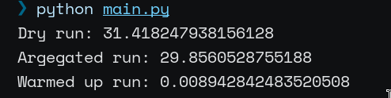

# Давыдов Михаил Б21-505 ПАРВПО Лабораторная работа N3 2024
## Реализуемая система

Сервис по просмотру картинок с собаками произвольной ширины.
```py
def get_dog_picture(width: int):
    cached = redis_client.get(str(width))
    if cached is not None:
        return b64decode(cached.decode())

    dog_picture = requests.get(f"https://place.dog/300/{width}", stream=True)

    redis_client.set(str(width), b64encode(dog_picture.content), ex=60)
    return dog_picture
```

Поскольку передача изображения довольно затратная операция, а сервис пользуется ОГРОМНОЙ популярностью, резонно кешировать изобрашения на стороне сервера хотя бы на минуту.

## Используемые технологии

1. Flask
2. Redis

## Результаты
Для тестирования были запрошены картинки с собаками ширины от 200 до 300px 

- Без кэша
- Без кэша, но с небольшой агрегацией
- С програевом кэша

Результаты представлены ниже


Очевидно, что чем больше результатов запроса попадет в память, тем быстрее завершиться процесс запроса 100 картинок с собаками. 
В случае с агрегацией, процент повторений запросов маленький, поэтому мы наблюдаем небольшое снижение времени работы. 

В случае же подогрева кэша все запросы обслуживаются из кэша, поэтому время исполнения команды такое маленькое.

## Заключение
В ходе работы мы плотнее познакомились с понятие кэша и его важностью при разработке приложений.
Результат Aggregated-run при правильной работе системы должен сильнее отличаться от dry-run, однако в силу высокой энтропии данных прогрев кэша займет время куда больше ожидаемого.
Результат запуска с прогретым кэшем напротив проводился с данными, обладающими довольно низкой энтропией, поэтому почти все запросы в ходе замеров попали в сохраненный кэш, что повлияло на общее время исполнения.
